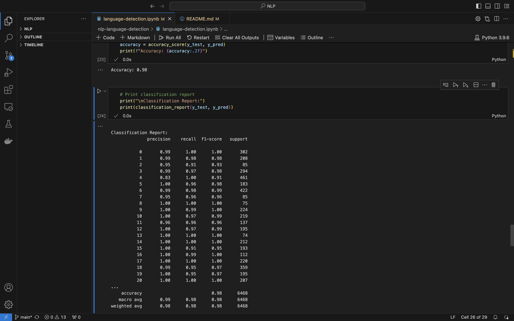

# nlp-language-detection-Models
Two different Algorithms to detect different languages using Python

# Language Detection using XLM-Roberta
This repository contains code for a language detection algorithm that identifies the language of a given text based on a dataset of 28 languages. The algorithm uses the `XLM-Roberta` model from Hugging Face's `transformers` library, fine-tuned on the provided dataset.

## Dataset
The dataset used for this project consists of texts labeled with their corresponding languages. The dataset is stored in a CSV file named `language-detection-full-dataset.csv`.

## Requirements
To run the code in this repository, you need to install the following dependencies:

- pandas
- transformers
- datasets
- torch
- scikit-learn

You can install these dependencies using pip:

```bash
pip install pandas transformers datasets torch scikit-learn
```
## Usage
1. Data Preprocessing
The text data is preprocessed by converting it to lowercase and removing non-word characters.

2. Tokenization
The XLM-Roberta tokenizer is used to tokenize the text data with a maximum length of 128 tokens.

3. Fine-Tuning
The XLM-RobertaForSequenceClassification model is fine-tuned on the training dataset using the Hugging Face Trainer class.

4. Evaluation
The model is evaluated on the test dataset, and the accuracy is computed.

## Running the Code
1. Clone this repository to your local machine:

```bash
git clone https://github.com/eshaanmathakari/nlp-language-detection
cd nlp-language-detection
```
2. Place the dataset file (language-detection-full-dataset.csv) in the repository directory.

3. Run the Jupyter notebook (language-detection.ipynb) to execute the code step-by-step.

## Results 
- Using the XLM-RobertaForSequenceClassification model we get skewed results. 
- Using Model with Existing data from NLTK Library, Random Forest and Cross Validation we get an accuracy of `98%`. 



## License
This project is licensed under the MIT License - see the LICENSE file for details.

## Acknowledgments
- The Hugging Face transformers library for providing the XLM-Roberta model.
- The contributor of the dataset used for this project- Tharun 
(https://www.kaggle.com/datasets/tharun369/language-detection-nlp-dataset)


